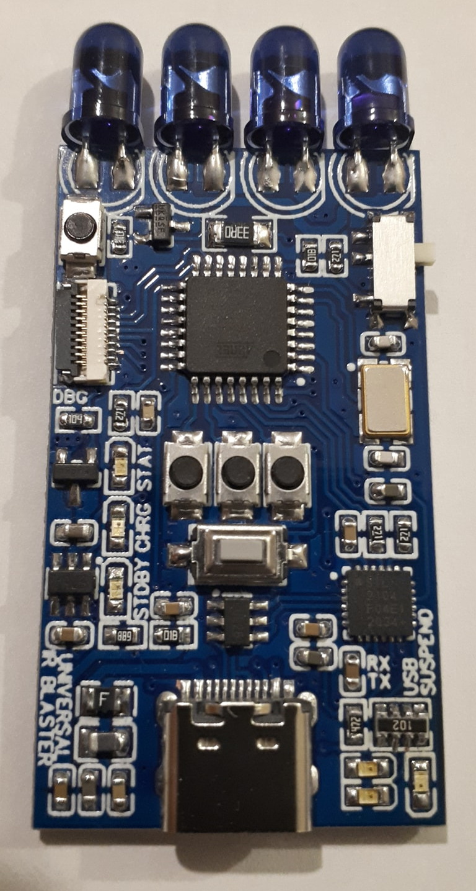
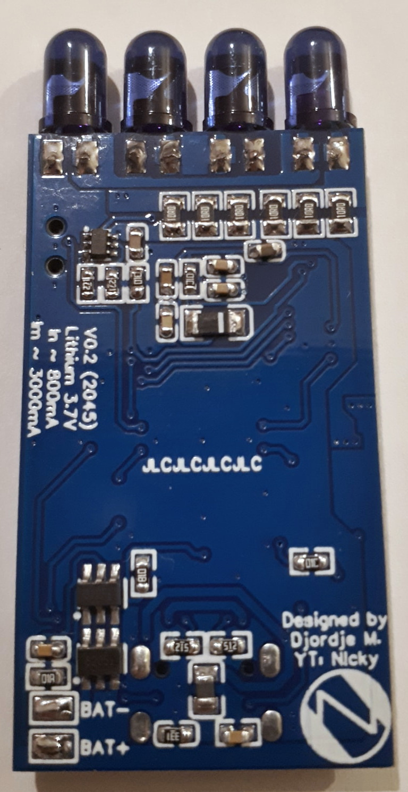

# Universal IR Blaster TV-B-Gone  
 This is firmware for Universal IR Blaster board designed by me. You can say that with this firmware and that board you get
 TV-B-Gone on steroids. Fully Arduino compatible board with bootloader.
 Schematic diagram of the board is available [here](Schematic/Universal%20IR%20Blaster%20V0.2%20(2045)%20Schematic.pdf).
 3D Model of the board is available [here](3D%20Model/Universal%20IR%20Blaster%20V0.2%203D%20Model/)

    

 ## Getting started
 You will need the following:
  - [Arduino IDE](https://www.arduino.cc/en/software) 1.8.13 and up
  - [Arduino MiniCore](https://github.com/MCUdude/MiniCore) 2.1.3 and up
  - [CP210x USB to UART Bridge VCP Drivers](https://www.silabs.com/developers/usb-to-uart-bridge-vcp-drivers)
  - Copy of this repository on your computer
  - Universal IR Blaster board or hardware compatible equivalent

  - To open the project go to `Universal_IR_Blaster_TV-B-Gone` folder and open `Universal_IR_Blaster_TV-B-Gone.ino` file in your Arduino IDE.
  - Now you have to select basic configuration: 
    - Tools -> Board -> MiniCore and select `ATmega328`
    - Tools -> Clock and select `External 8MHz`
    - Tools -> BOD and select `BOD 2.7V`
    - Tools -> EEPROM and select `EEPROM retained` (if you select not retained you will have to program eeprom before uploading this firmware)
    - Tools -> Compiler LTO and select `LTO enabled`
    - Tools -> Variant and select `328P / 328PA`
    - Tools -> Bootloader and select `Yes (UART0)`
    - Select your COMx port of Universal IR Blaster board
 You're now ready to compile and upload the firmware to the board. Make sure the top right on/off button is pulled down.

 ## Key Hardware Features
 Here is a small collection of key hardware features that stand out compared to classic TV-B-Gone
  - Small size of 25.5mm x 45mm + lenght of LEDs (drone Li-Po battery fits perfectly under)
  - Lithium Ion/Polymer Battery Charging and Protection circuit
  - Measurement of charging current
  - CP2104 USB to Serial Converter with 2 GPIO connected to CHRG LED and one pin of ATmega328P (configured as open-drain) and activity LEDs
  - ESD protection for USB data lines
  - PTC Ressetable PolyFuse on VBUS
  - 4 buttons of which 1 is connected to INT0
  - High power output stage for IR LEDs. They can be paralled up but only with series resistor(you must never connect 2 LEDs directly)
  - Arduino compatible design
  - Flat flex cable connector for debugging and expansion. 0.5mm Pin pitch with RX-TX-RST-MISO-MOSI-SCK-IR_SIG-IPROG-VCC-GND broken out
  - Dummy pulldown resistor on PD5 for expansion of features and debugging

 ## Key Firmware Features
 The most useful updates in firmware compared to TV-B-Gone V1.3
  - EEPROM check to prevent firmware from running on different hardware
  - Internal 1V1 reference voltage is stored in EEPROM for calibration and better accuraccy
  - Control via Serial port
  - Multiple 'users' that are selectable using option switches and via Serial port
  - Watchdog timer protection for IR LEDs in case something goes wrong
  - Sleep mode can be temporarly disabled during boot
  - Codes are decompressed into 1kB buffer in RAM before actually emitting code elements for better 'off' time accuracy
  - Charging current and supply voltage can be monitored
  - STAT LED blinking every 2 seconds if sleep mode is disabled (overriden)
  - STAT LED brightness controllable using [PalatisSoftPWM by per1234 & Palatis](https://github.com/per1234/PalatisSoftPWM)
  - Low Battery indication via STAT LED fading out 2 times
  - Region change on the fly

 ## Serial Port Control
 Here is example of few commands and how to use them at `1000000 (1M BAUD)` baud rate:
  - Numbers 0 to 3 set the current selected user. 0 is default region code list hardcoded in firmware, 1 to 3 are users 1 to 3 respectively
  - `[T]` is the same as holding the WAKE button but option switches will be ignored for user selection and selected user will be used
  - `[S]` stops the transmission of codes
  - `[N]` will start transmission and wait for next N before sending each code. Also code ID can be entered to skip to specific code right away. Useful for development and testing each code
  - `[I]` prints out information menu
  - `[P]` Sets PWM value `[1-255]` for STAT LED
  - `[D]` enables or disables debug mode. Debug mode is just a more text printed to serial console during the firmware's operation. Code traceing basically
  - `[Q]` measures IPROG and AVCC, does calcuations, samples some registers and ram data, spits it out in JSON format

Be careful because only upper case letters are accepted. Control via serial port is a big feature for me because it allows me to use USB-OTG cable and hide the Universal IR Blaster while actually using it. Something like a ESP8266Deauther.

 ## Ideas 
  - USB host can read and control CP2104 GPIO state so that we can have info if battery is charging or not. Also USB host can override sleep mode on ATmega328P and turn it off by holding GPIO3 of CP2104 during the reset of ATmega328P which is also possible via DTR line. After ATmega328P has sleep mode disabled (overriden) we can use GPIO3(open-drain) and PD4 for direct communication between host and ATmega328P.
  - USB host side program or Android app can be made to have nice GUI for control of the Universal IR Blaster. Data can be queried only while codes are not transmitted for now. We could implement that after setup is done the PD4 will wait with PULLUP for GPIO3 to pull that pin low to request JSON data.
  - Nice case can be 3D printed but I do not own 3D printer nor I have the creativity to design one.

 ## Some other projects with this board
  - [GirsUIRB - Girs infrared server optimized for IrScrutinizer and LIRC ](https://github.com/DjordjeMandic/GirsUIRB)

 ## Acknowledgements
  - Mitch Altman
  - Limor Fried
  - Kevin Timmerman
  - Damien Good
  - Ron Branes (KA1KJZ)
  - Ken Shirriff
  - Fabriel Staples
  - Djordje Mandic
  - per1234 & Palatis

 ## License
 This code in written under Distributed under Creative Commons 2.5 -- Attribution & Share Alike license. Check out `License And Changes.txt` for more information.

